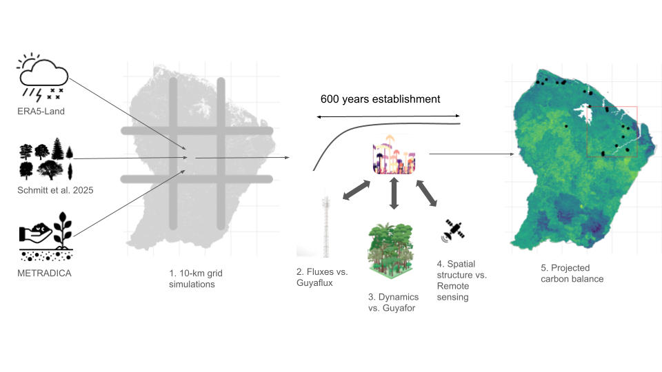

# TROLL FG
Sylvain Schmitt
Sep 19, 2025

The general idea is to test TROLL 4.0’s ability to simulate the regional
pattern of carbon balance (first test with gross primary production
(GPP)) in French Guiana (Maréchaux et al. 2024; Schmitt et al. 2024). We
will evaluate the spatial projections produced against regional patterns
of forest structure derived from remote sensing, as well as point-wise
forest inventories for forest dynamics and diversity, and single-point
fluxes from an eddy tower. Further work could then explore the effect of
future climates on the carbon balance.

## Usage

**troll_fg** analyses rely on the quarto documents (`files.qmd`) that
can be run with R and associated environment defined with [renv](#0).

## Project

**troll_tee** includes:

- Analyse of the data with associated documentation and figures:
  - Reproductive analyses in `files.qmd`
  - Resulting pages in `docs/`
  - Document structure definition in `_quarto.yml`
- All data in `data/`
- `simulations/` contain the snakemake and singularity workflow to run
  all simulations.
- Intermediary files in `outputs/`
- Figures in `figures/`
- R environment definition with
  [renv](https://rstudio.github.io/renv/articles/renv.html) in `renv/`
  and `renv/lock`
- R files (`.Rbuildignore` , `.Rdata` , `.Rprofile` , `.Rhistory`)
- Git and GitHub files (`.gitignore` , `.github/`)
- Project documentation (`README.qmd` , `README.md` , `NEWS.md` ,
  `LICENSE`)

## Poeple

- Sylvain Schmitt (sylvain.schmitt@cirad.fr)
- Jérôme Chave (jerome.chave@univ-tlse3.fr)
- Isabelle Maréchaux (isabelle.marechaux@inrae.fr)

## References

Maréchaux, Isabelle, Fabian Jörg Fischer, Sylvain Schmitt, and Jérôme
Chave. 2024. “TROLL 4.0: Representing Water and Carbon Fluxes, Leaf
Phenology and Intraspecific Trait Variation in a Mixed-Species
Individual-Based Forest Dynamics Model Part 1: Model Description.”
<http://dx.doi.org/10.5194/egusphere-2024-3104>.

Schmitt, Sylvain, Fabian Fischer, James Ball, Nicolas Barbier, Marion
Boisseaux, Damien Bonal, Benoit Burban, et al. 2024. “TROLL 4.0:
Representing Water and Carbon Fluxes, Leaf Phenology, and Intraspecific
Trait Variation in a Mixed-Species Individual-Based Forest Dynamics
Model Part 2: Model Evaluation for Two Amazonian Sites.”
<http://dx.doi.org/10.5194/egusphere-2024-3106>.

